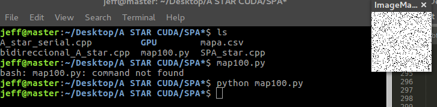
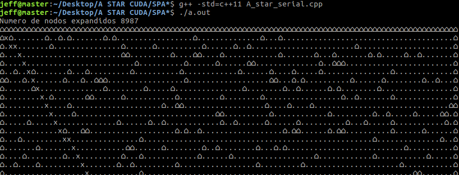
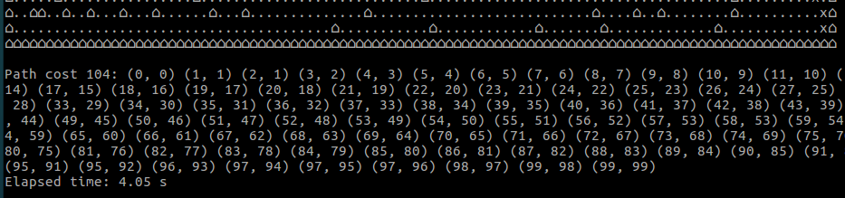

# Bidireccional-A-STAR-en-GPU
Proyecto de investigación presentado para seminario de tesis CS-UNSA , 
este proyecto tiene como objetivo optimizar el algoritmo bidireccional A*
en un entorno GPU, para lograr este objetivo se implemento el algoritmo A*
en forma serial el algoritmo bidireccional A* en forma serial, y
el algoritmo SPA*(Simple Parallel A*)

# Procesando el mapa en caso es de 100x100

# Compilando y ejecutando el algoritmo A* serial
Se aprecia el numero de nodos expandidos

Se aprecia el tiempo de ejecución

